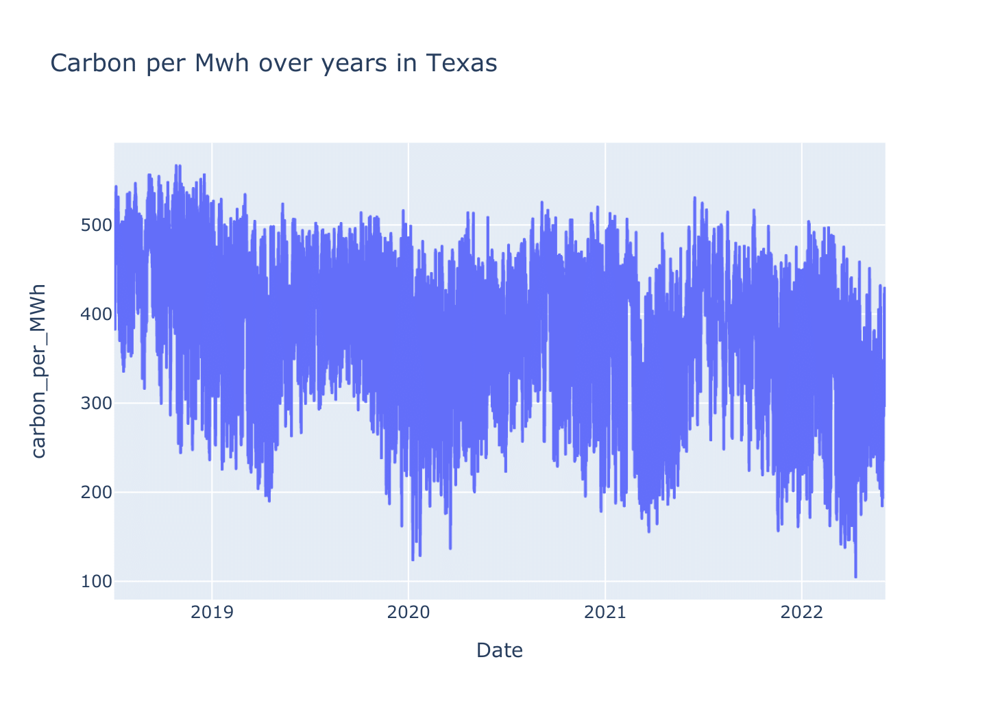

# Cloud Scheduler Simulation :boom: :boom: :star2:

## About project
Project was created as part of the course carried out in AGH. It's a proof of concept of how dynamic job scheduling can save significant amount of CO2 emitted to the atmosphere. We have collect our data from two sites: [USA](https://www.eia.gov/) and [EU](https://www.entsoe.eu/). Then we preprocess it and feed ML algorithms so we can predict the carboon footprint per MWh. 

## Data visualization

Herein you can see some basic visualizations of time series:

We have also check trend and seasonality of data:

## ML models

We also create some ML models to predict carboon footrpint.

Herein, you can see results from our DNN:

## Job simulation

We create simple job simulations and check how two types (naive and optmized) of jobs scheduling may contribute to CO2 emission.

Thanks to [OR-tools](https://developers.google.com/optimization) we were able to optimize our job scheduling.

## Results

As we expected, simulations with optimized methods helps to reduce significant amount of CO2.

